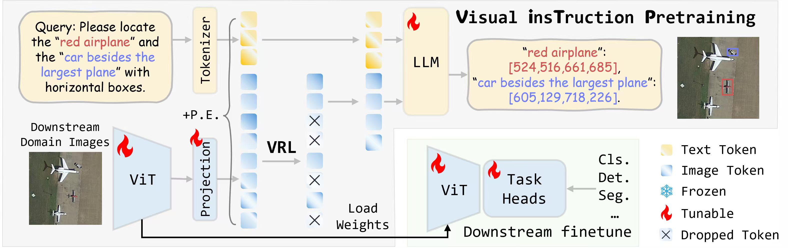
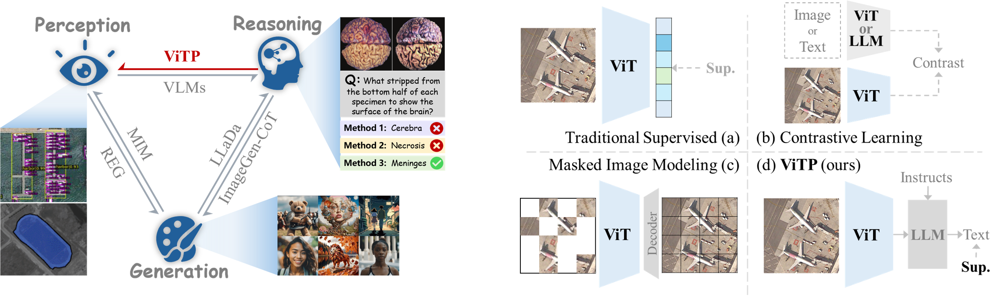
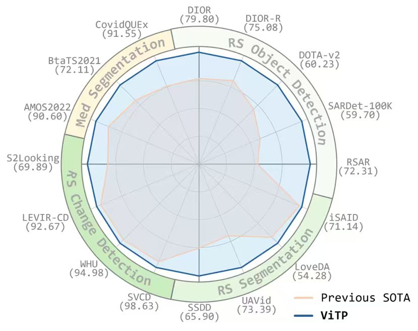

<h1 align="center"> Visual Instruction Pretraining for Domain-Specific Foundation Models </h1>

<p align="center">
<a href="http://arxiv.org/abs/2509.17562"></a>
<a href="https://huggingface.co/GreatBird/ViTP"></a>
<a href="https://www.modelscope.cn/datasets/GreatBird/ViTP/files"></a>
</p>

<h5 align="center"><em>Yuxuan Li, Yicheng Zhang, Wenhao Tang, Yimian Dai, Ming-Ming Cheng, Xiang Li, and Jian Yang </em></h5>


## This repository is the official implementation of ["Visual Instruction Pretraining for Domain-Specific Foundation Models"](ViTP.pdf).

<p align="center">
  <a href="#abstract">Abstract</a> |
  <a href="#performance">Performance</a> |
  <a href="#usage">Usage</a> 
</p >


# Abstract
Modern computer vision is converging on a closed loop in which perception, reasoning and generation mutually reinforce each other. However, this loop remains incomplete: the top-down influence of high-level reasoning on the foundational learning of low-level perceptual features is not yet underexplored. This paper addresses this gap by proposing a new paradigm for pretraining foundation models in downstream domains. We introduce **V**isual **i**ns**T**ruction **P**retraining (ViTP), a novel approach that directly leverages reasoning to enhance perception. ViTP embeds a Vision Transformer (ViT) backbone within a Vision-Language Model and pretrains it end-to-end using a rich corpus of visual instruction data curated from target downstream domains. ViTP is powered by our proposed Visual Robustness Learning (VRL), which compels the ViT to learn robust and domain-relevant features from a sparse set of visual tokens. Extensive experiments on 16 challenging remote sensing and medical imaging benchmarks demonstrate that ViTP establishes new state-of-the-art performance across a diverse range of downstream tasks. The code is available at [GitHub](https://github.com/zcablii/ViTP).

---



Figure 1: A conceptual illustration of the ViTP framework. A ViT backbone is embedded within a large VLM and then pretrained with domain-specific instruction following objective and Visual Robustness Learning (VRL). This process instils high-level semantic understanding into the ViT. The resulting weights are then used to initialize models for various downstream perception tasks.




Figure 2: (Left) The synergistic relationship between perception, generation, and reasoning in modern CV. Our proposed ViTP forges a novel link from high-level reasoning to low-level perception, a previously underexplored connection. (Right) Comparison of pretraining paradigms for ViT foundation models. ViTP employs an instruction-following objective to directly instil domain-specific perception capabilities into the vision backbone.


---


# Pretrained Model

<table>
    <tr>
        <th >Model</th>
        <th >Parameters</th>
        <th >Pretrain Dataset</th>
        <th >Weights</th>
    </tr>
    <tr>
        <td> ViTP_ViT_L_rs</td>
        <td>300M</td>
        <td rowspan=2><a href= https://www.modelscope.cn/datasets/GreatBird/ViTP/files >modelscope</a> <br> <a href= https://huggingface.co/GreatBird/ViTP/tree/main/pretrain_data >huggingface</a></td>
        <td><a href= https://huggingface.co/GreatBird/ViTP/resolve/main/ckpts/ViTP_ViT_L_300M_rs.safetensors?download=true >ViTP_ViT_L_300M_rs</a></td>
    </tr>
    <tr>
        <td> ViTP_ViT_L_med</td>
        <td>300M</td>
        <td><a href= https://huggingface.co/GreatBird/ViTP/resolve/main/ckpts/ViTP_ViT_L_300M_med.safetensors?download=true >ViTP_ViT_L_300M_med</a></td>
    </tr>
</table>

## Performance



---
# Domain-Specific Finetuning
## Prepare downstream task datasets
Remote Sensing Object Detection
- [DOTAv2](https://captain-whu.github.io/DOTA/dataset.html)

- [DIOR](https://drive.google.com/drive/folders/1UdlgHk49iu6WpcJ5467iT-UqNPpx__CC)

- [DIOR-R](https://drive.google.com/drive/folders/1UdlgHk49iu6WpcJ5467iT-UqNPpx__CC)

- [SARDet-100K](https://www.kaggle.com/datasets/greatbird/sardet-100k)

- [RSAR](https://github.com/zhasion/RSAR?tab=readme-ov-file)

- [SSDD](https://github.com/TianwenZhang0825/Official-SSDD)

Remote Sensing Semantic Segmentation
- [iSAID](https://captain-whu.github.io/iSAID/dataset.html)

- [LoveDA](https://github.com/Junjue-Wang/LoveDA)

- [UAVid](https://uavid.nl/)

Remote Sensing Change Detection
- [SVCD](https://drive.google.com/file/d/1GX656JqqOyBi_Ef0w65kDGVto-nHrNs9/edit)

- [WHU](https://www.kaggle.com/datasets/clannaspark/whu-cd)

- [LEVIR-CD train](https://drive.google.com/file/d/17IYSHGEfIfUhC5XKQEnd-5poFrqTmCcY/view?usp=drive_link), [LEVIR-CD test](https://levir.buaa.edu.cn/datasets/index.html)

- [S2Looking](https://github.com/S2Looking/Dataset)

Medical Imaging Semantic Segmentation
- [AMOS2022](https://hf-mirror.com/GreatBird/ViTP/resolve/main/pretrain_data/images/AMOS2022.zip?download=true)


- [BraTS2021](https://hf-mirror.com/GreatBird/ViTP/resolve/main/pretrain_data/images/brats.zip?download=true)


- [CovidQUEx](https://hf-mirror.com/GreatBird/ViTP/resolve/main/pretrain_data/images/covid_quex.zip?download=true)


## Object Detection
Weight and Logs are available at [modelscope](https://www.modelscope.cn/datasets/GreatBird/ViTP/files) and [HuggingFace](https://huggingface.co/GreatBird/ViTP/tree/main/ckpts).

| Dataset | Modal | Anno Format | Method | mAP | Config | 
| :------: | :-----: | :-----: | :-----: | :-----: | :-----: | 
| DIOR | RGB | Hori. Box | Cascade-RCNN | 79.80 | [Config](mmrotate/ViTP_configs/vitp_dior_cascade_rcnn.py)|
| DIOR-R | RGB | Ori. Box | Oriented-RCNN | 75.08 | [Config](mmrotate/ViTP_configs/vitp_diorr_orcnn.py)|
| DOTA-v2.0 | RGB | Ori. Box |  Oriented-RCNN | 60.23 | [Config](mmrotate/ViTP_configs/vitp_dotav2_orcnn.py)| 
| SARDet-100K | SAR | Hori. Box | Cascade-RCNN | 57.9 | [Config](mmrotate/ViTP_configs/vitp_sardet100k_cascade_rcnn.py)|
| SSDD | SAR | Hori. Box | Mask-RCNN | 70.80 | [Config](mmrotate/ViTP_configs/vitp_ssdd_orcnn.py)|
| RSAR | SAR | Ori. Box | Oriented-RCNN | 72.31 | [Config](mmrotate/ViTP_configs/vitp_rsar_orcnn.py)|

## Semantic Segmentation


Weight and Logs are available at [modelscope](https://www.modelscope.cn/datasets/GreatBird/ViTP/files) and [HuggingFace](https://huggingface.co/GreatBird/ViTP/tree/main/ckpts).

| Dataset | Modal | Anno Format | Method | mIoU | Config | 
| :------: | :-----: | :-----: | :-----: | :-----: | :-----: | 
| iSAID | RGB | Mask | UNet | 71.14 | [Config](mmseg/ViTP_configs/ViTP_isaid_upernet.py)|
| LoveDA | RGB | Mask | UperNet | 54.28 | [Config](mmseg/ViTP_configs/vitp_loveda_upernet.py)|
| UAVid | RGB | Mask | UperNet | 73.39 | [Config](mmseg/ViTP_configs/vitp_uavid_upernet.py)|
| SSDD | SAR | Polygons | UperNet | 65.90(AP) | [Config](mmrotate/ViTP_configs/vitp_ssdd_orcnn.py)|


## Change Detection


Weight and Logs are available at [modelscope](https://www.modelscope.cn/datasets/GreatBird/ViTP/files) and [HuggingFace](https://huggingface.co/GreatBird/ViTP/tree/main/ckpts).

| Dataset | Modal | Anno Format | Method | F1 | Config |
| :------: | :-----: | :-----: | :-----: | :-----: | :-----: |
| SVCD | RGB | Mask | UperNet | 98.63 | [Config](opencd/ViTP_configs/vitp_svcd_upernet.py) | 
| WHU | RGB | Mask | UNet | 94.98 | [Config](opencd/ViTP_configs/vitp_whu_unet.py) | (https://huggingface.co/GreatBird/ViTP/tree/main/ckpts) |
| LEVER | RGB | Mask | UNet | 92.67 | [Config](opencd/ViTP_configs/vitp_lever_unet.py) |(https://huggingface.co/GreatBird/ViTP/tree/main/ckpts) |
| S2Looking | RGB | Mask | UNet | 69.89 | [Config](opencd/ViTP_configs/vitp_s2looking_unet.py) | 

---
# Usage
- Clone this repository:
```
git clone https://github.com/zcablii/ViTP.git
```
## Object Detection
### Installation

- Create a conda environment:
```
cd ViTP/mmrotate
conda create -n vitp-det python==3.10
conda activate vitp-det
```

- Install the required packages:
```
pip install torch==1.12.0+cu113 torchvision==0.13.0+cu113 torchaudio==0.12.0 -f https://download.pytorch.org/whl/torch_stable.html
pip install mmcv-full==1.6.1 -f https://download.openmmlab.com/mmcv/dist/cu113/torch1.12.0/index.html
pip install -r requirements.txt
```
- Insatall flash attention:
  
```
git clone https://github.com/Dao-AILab/flash-attention.git
cd flash-attention
git checkout v0.2.8
pip install ninja
python setup.py install
cd ..
```
- Install mmcv:
```
cd ../mmcv
python setup.py install
cd mmrotate
```
- Install mmrotate:
```
pip install -e .
```
- compile deformable attention:
```
cd ops
sh make.sh
cd ..
```
### Train
```
sh ./tools/dist_train.sh ViTP_configs/vitp_dotav2_orcnn.py 8 
```
### Test
```
sh ./tools/dist_test.sh ./ViTP_configs/vitp_dotav2_orcnn.py ./work_dirs/vitp_dotav2_orcnn/latest.pth 8 --format-only --eval-options submission_dir=./results/vitp_dotav2_orcnn
```

## Segmentation
### Installation

- Create a conda environment:
```
cd ViTP/mmseg
conda create -n vitp-seg python==3.10
conda activate vitp-seg
```

- Install the required packages:
```
pip install torch==1.12.0+cu113 torchvision==0.13.0+cu113 torchaudio==0.12.0 -f https://download.pytorch.org/whl/torch_stable.html
pip install mmcv-full==1.6.1 -f https://download.openmmlab.com/mmcv/dist/cu113/torch1.12.0/index.html
pip install -r requirements.txt
```
- Install flash attention:
  
```
git clone https://github.com/Dao-AILab/flash-attention.git
cd flash-attention
git checkout v0.2.8
pip install ninja
python setup.py install
cd ..
```
- Install mmcv:
```
cd ../mmcv
python setup.py install
cd mmseg
```
- Install mmsegmentation:
```
pip install -e .
```
- compile deformable attention:
```
cd ops
sh make.sh
cd ..
```
### Train
```
sh ./tools/dist_train.sh ViTP_configs/vitp_isaid_upernet.py 8 
```
### Test
```
sh ./tools/dist_test.sh ./ViTP_configs/vitp_isaid_upernet.py ./work_dirs/vitp_isaid_upernet/latest.pth 8 --eval mIoU
```
## Change Detection
### Installation

- Create a conda environment:
```
cd ViTP/opencd
conda create -n vitp-cd python==3.10
conda activate vitp-cd
```

- Install the required packages:
```
pip install torch==1.12.0+cu113 torchvision==0.13.0+cu113 torchaudio==0.12.0 -f https://download.pytorch.org/whl/torch_stable.html
pip install -U openmim
mim install mmcv==2.0.0
mim install mmpretrain==1.2.0
pip install -r requirements.txt
```
- Install flash attention:
  
```
git clone https://github.com/Dao-AILab/flash-attention.git
cd flash-attention
git checkout v0.2.8
pip install ninja
python setup.py install
cd ..
```

- Install open-cd:
```
pip install -e .
```
### Train
```
sh ./tools/dist_train.sh ./ViTP_configs/vitp_s2looking_upernet.py 8
```
### Test
```
sh ./tools/dist_test.sh ./ViTP_configs/vitp_s2looking_upernet.py ./work_dirs/vitp_s2looking_upernet/iter_120000.pth 8
```
---
### Citation
If you use this toolbox or benchmark in your research, please cite this project.

```bibtex
@article{Li_2025_ViTP,
  title={Visual Instruction Pretraining for Domain-Specific Foundation Models},
  author={Li, Yuxuan and Zhang, Yicheng and Tang, Wenhao and Dai, Yimian and Cheng, Ming-Ming and Li, Xiang and Yang, Jian},
  journal={arXiv},
  year={2025}
}
```


## License
Licensed under a [Creative Commons Attribution-NonCommercial 4.0 International](https://creativecommons.org/licenses/by-nc/4.0/) for Non-commercial use only.
Any commercial use should get formal permission first.SM3Det: A Unified Model for Multi-Modal Remote Sensing Object Detection
